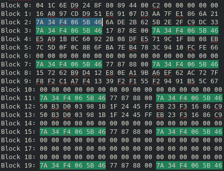

# Flipper-Infinity

I slightly modified [Equipter's ClassicConverter](https://github.com/equipter/ClassicConverter) [7B_Converter.py](/Scripts/7B_Converter.py) for the conversion.  
Edit the desired NFC file with the key A in these spots  
  
Transfer file to FZ and emulate.
